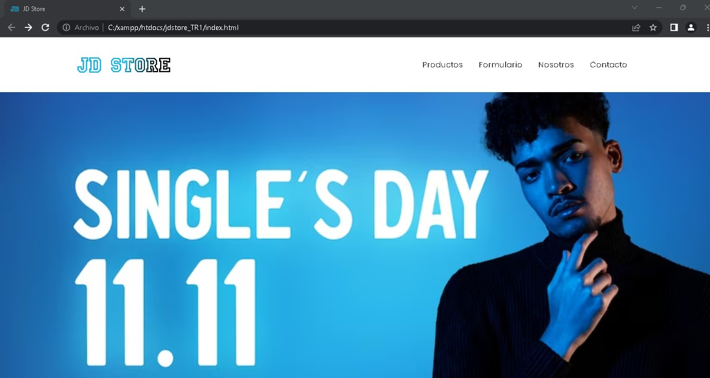
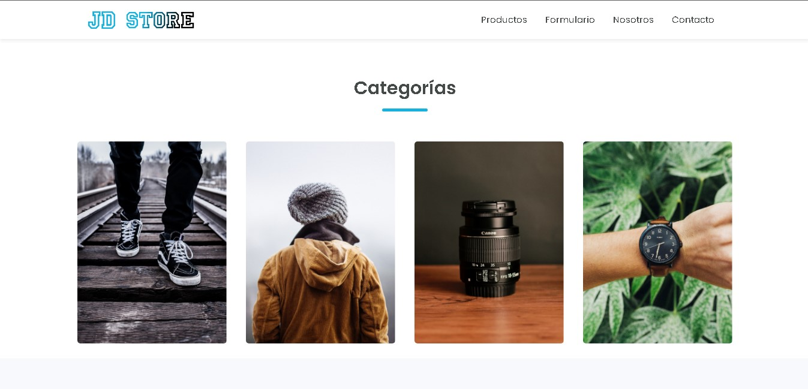
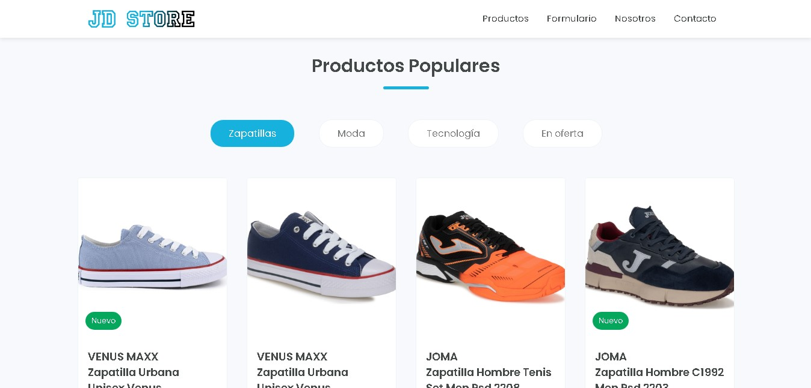
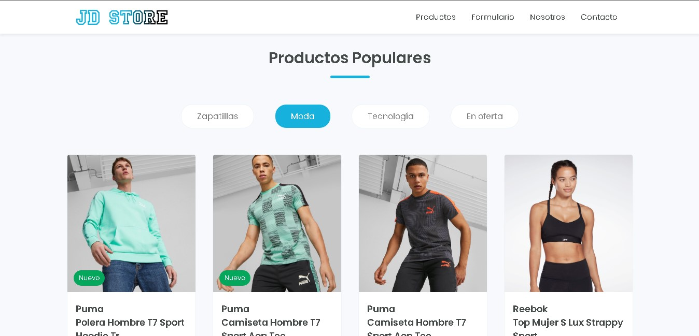
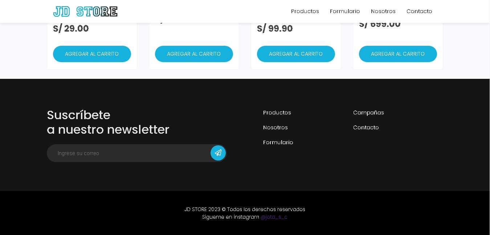
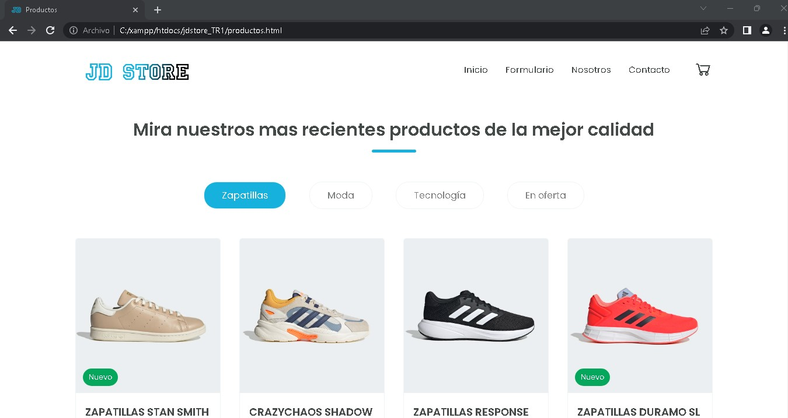
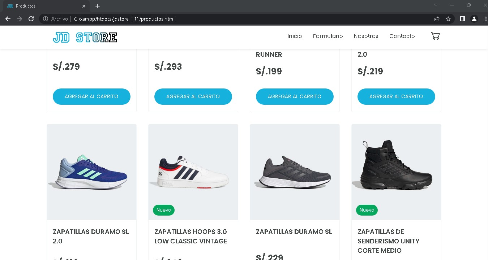
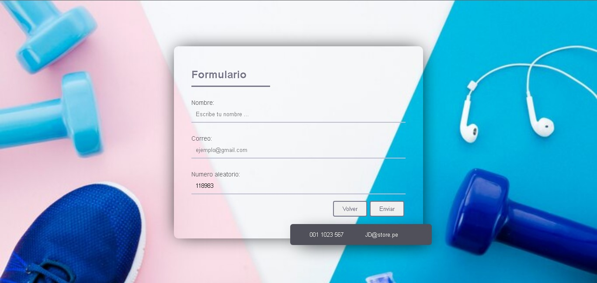

# **Digital Buho** 
## **Pagina ecommerce con AOS (vista)**: carrito de compras
[Ver demo ->](https://github.com/jefersc/Pagina_web_carrito.git)

## **Paginas Principales:**

 
<h1 align="center"><strong> 🚀 Inicio:</strong></h1>
 

 
<h2 align="center"><strong> 👾 Categorias:</strong></h2>
 

 
<h2 align="center"><strong> 👟 Zapatillas:</strong></h2>
 

 
<h2 align="center"><strong> 🕴️ Moda:</strong></h2>
 

### Footer :

##  🥇 Productos:
*en esta pagina se muestra todos los productos,los unico que debe gacer el usario es dar click en los items de moda,zapatillas,etc...*

## 📝 Formulario :

## ☎️ Contacto :

 
<h2 align="center"><strong> ☆ "icono de la pagina del formulario" ☆:</strong></h2>

  

  

